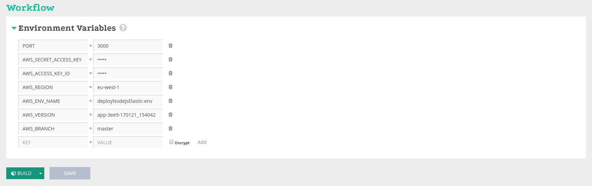
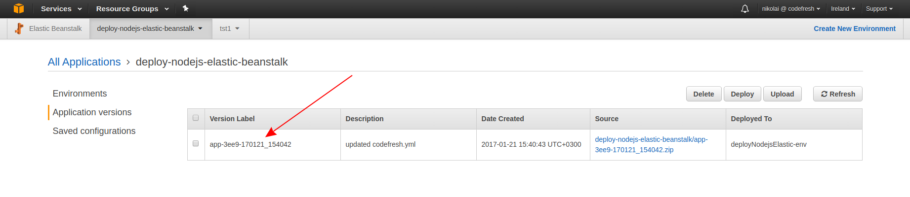
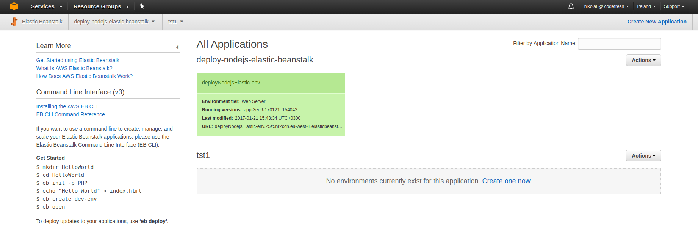
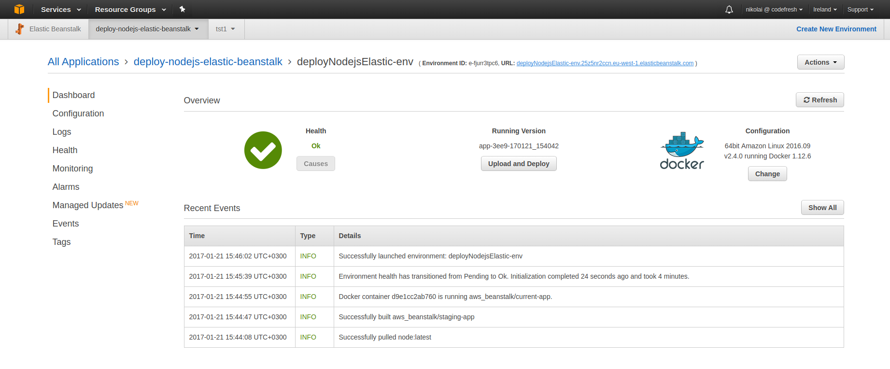
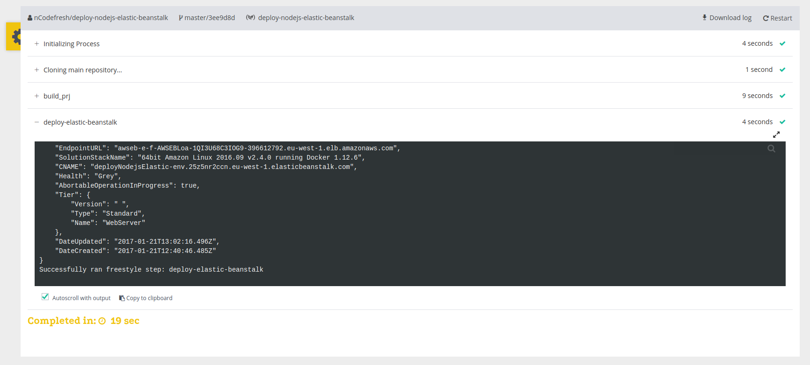

# cf-example-deploy-elasticbeanstalk
[]( https://g.codefresh.io/repositories/codefreshdemo/cf-example-deploy-elasticbeanstalk/builds?filter=trigger:build;branch:master;service:58836950b2f11c0100175173~cf-example-deploy-elasticbeanstalk)

Deployment to Elastic Beanstalk

### Prerequiests
- Configured Application and task definition with an created environment.
  See http://docs.aws.amazon.com/elasticbeanstalk/latest/dg/GettingStarted.html

### Deployment with Codefresh
- Add encrypted environment variables for aws credentials.
     * AWS_ACCESS_KEY_ID
     * AWS_SECRET_ACCESS_KEY
- Provide the following environment variables:
    * AWS_REGION
    * AWS_ENV_NAME
    * AWS_VERSION
    * AWS_BRANCH



The ``${{AWS_VERSION}}`` of application you can find in the Elastic Beanstalk service


Add the following step to codefresh.yml

```yml
deploy-elastic-beanstalk:
    fail-fast: false
    image: garland/aws-cli-docker:latest
    commands:
     - sh -c  "aws configure set region '${{AWS_REGION}}' && aws elasticbeanstalk update-environment --environment-name '${{AWS_ENV_NAME}}' --version-label '${{AWS_VERSION}}' "
    when:
      condition:
        all:
          masterBranch: "'${{CF_BRANCH}}' == '${{AWS_BRANCH}}'"
```

### Deployment Flow
- go to the Elastic Beanstalk service and create an application and environment

- perform the following commands from root of your project
    * eb init
    * eb create ${{AWS_ENV_NAME}}

Note: If you don't have awsebcli - install EB CLI http://docs.aws.amazon.com/elasticbeanstalk/latest/dg/eb-cli3-install.html



- add this repository to Codefresh, provide the necessary environments variables and build this service
